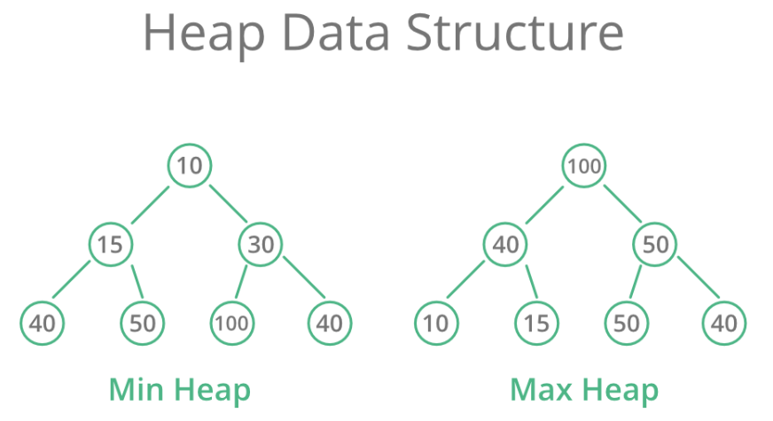

# Heap

A Heap is a special Tree-based data structure in which the tree is a **complete binary tree**. There are 2 types of Heap:

- **Max-Heap** $\leadsto$ In a Max-Heap the key present at the root node must be greatest among the keys present at all of it’s children. The same property must be recursively true for all sub-trees in that Binary Tree.

- **Min-Heap** $\leadsto$ In a Min-Heap the key present at the root node must be minimum among the keys present at all of it’s children. The same property must be recursively true for all sub-trees in that Binary Tree.

## Operations

- Heapify: a process of creating a heap from an array.
- Insertion: process to insert an element in existing heap time complexity O(log N).
- Deletion: deleting the top element of the heap or the highest priority element, and then organizing the heap and returning the element with time complexity O(log N).
- Top: to check or find the first (or can say the top) element of the heap.

## Implementation

The insertions and deletions in a Heap could be a little complex, so most of the implementations are made with an array in which:

- The index of left child is given by 2i + 1 and the right child is given by 2i + 2.
- The index of a node is (i-1)/2
- When inserting a node, check if the heap condition is still fulfilled and insert it like a in a CBT.
- We will always delete the root in a heap, we will swap values with it's children until we reach a leaf node, then we delete that node. 