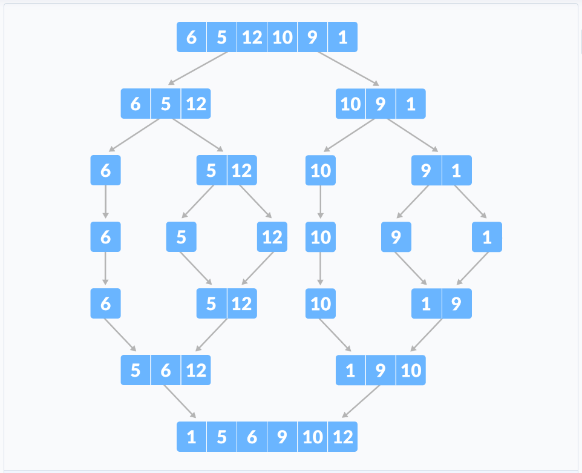

# Sorting

## Implmented std::sort algorithm 

```cpp
template <class RandomAccessIterator>  void sort (RandomAccessIterator first, RandomAccessIterator last);

template <class RandomAccessIterator, class Compare>  void sort (RandomAccessIterator first, RandomAccessIterator last, Compare comp);

```

**Example**

```cpp
bool myfunction (int i,int j) { return (i<j); }

struct myclass {
  bool operator() (int i,int j) { return (i<j);}
} myobject;

int main () {
  int myints[] = {32,71,12,45,26,80,53,33};
  std::vector<int> myvector (myints, myints+8);               // 32 71 12 45 26 80 53 33

  // using default comparison (operator <):
  std::sort (myvector.begin(), myvector.begin()+4);           //(12 32 45 71)26 80 53 33

  // using function as comp
  std::sort (myvector.begin()+4, myvector.end(), myfunction); // 12 32 45 71(26 33 53 80)

  // using object as comp
  std::sort (myvector.begin(), myvector.end(), myobject);     //(12 26 32 33 45 53 71 80)

  // print out content:
  std::cout << "myvector contains:";
  for (std::vector<int>::iterator it=myvector.begin(); it!=myvector.end(); ++it)
    std::cout << ' ' << *it;
  std::cout << '\n';

  return 0;
```

**Complexity**

On average, linearithmic in the distance between first and last: Performs approximately **O($nlog_2n$)** (where n is this distance) comparisons of elements, and up to that many element swaps.

**Why is Heapsort used (and not Mergesort etc)?**

This is solely because of memory requirements. Merge sort requires O(N) space whereas Heapsort is an in-place O(1) space algorithm. 

## Bubble Sort

Bubble sort is a sorting algorithm that compares two adjacent elements and swaps them until they are in the intended order. Steps: 

1. Starting from the first index, compare the first and the second elements.
2. If the first element is greater than the second element, they are swapped.
3. Now, compare the second and the third elements. Swap them if they are not in order.
4. The above process goes on until the last element.

Naive Version
```cpp
int main(){
    vector <int> nums = {3, 0, 8, 1, 4, 2, 8};
    int n = nums.size();
    for(int i = 0; i<n; i++){
        for(int j = 0; j<n-1; j++){
            if(nums[j]>nums[j+1])
                swap(nums[j], nums[j+1]);
        }
    }
    for(auto n : nums) cout<<n<<" "; // 0 1 2 3 4 8 8
    return 0;
}
```

Optimized Version. Since after each iteration, the largest element among the unsorted elements is placed at the end. We don't have to reach the end in every iteration, we just have to reach the n - i position in every iteration. And if the vector is sorted we dont do any iteration.

```cpp
int main(){
    vector <int> nums = {3, 0, 8, 1, 4, 2, 8};
    bool flag = 1;
    int n = nums.size();
    while(flag){
        flag = 0;
        for(int i = 0; i<n; i++){
            if(nums[i]>nums[i+1]) {
                flag = 1;
                swap(nums[i], nums[i+1]);
            }
        }
        n--;
    }
    for(auto n : nums) cout<<n<<" "; // 0 1 2 3 4 8 8
    return 0;
}
```
|Complexity     |     |
|---            |---  |
|Time Complexity|O(n^2)|
|Space Complexity|O(1)|

## Selection Sort

Selection sort is a sorting algorithm that selects the smallest element from an unsorted list in each iteration and places that element at the beginning of the unsorted list. Steps:

1. Set the current element as minimum
2. Compare minimum with the next element. If the next element is smaller than minimum, assign the next element as minimum.
3. The process goes on until the last element. 
4. Swap values between the current and the minimun value. 
4. For each iteration, indexing starts from the first unsorted element. Step 1 to 3 are repeated until all the elements are placed at their correct positions.

After each iteration, minimum is placed in the front of the unsorted list.

```cpp
int main(){
    vector <int> nums = {3, 0, 8, 1, 4, 2, 8};
    int n = nums.size();
    for(int i = 0; i < n-1; i++){
        int idx = i;
        for(int j = i  + 1; j < n; j++){
            if(nums [j] < nums[idx]){
                idx = j;
            }
        }
        swap(nums[i], nums[idx]);
    }
    for(auto n : nums) cout<<n<<" ";
    return 0;
}
```

|Complexity     |     |
|---            |---  |
|Time Complexity|O(n^2)|
|Space Complexity|O(1)|

## Insertion Sort

Insertion sort works similarly as we sort cards in our hand in a card game.

We assume that the first card is already sorted then, we select an unsorted card. If the unsorted card is greater than the card in hand, it is placed on the right otherwise, to the left. In the same way, other unsorted cards are taken and put in their right place. Basically we have an element and we search to it's correct place. Steps:

1. The first element in the array is assumed to be sorted. Take the second element and store it separately in key.
2. Compare key with the first element. If the first element is greater than key, then key is placed in front of the first element.
3. Now, the first two elements are sorted. Take the third element and compare it with the elements on the left of it. Placed it just behind the element smaller than it. If there is no element smaller than it, then place it at the beginning of the array.
4. Similarly, place every unsorted element at its correct position.

```cpp
int main(){
    vector <int> nums = {3, 0, 8, 1, 4, 2, 8};
    int n = nums.size();
    for(int i = 1; i < n; i++){
        int j= i-1;
        while(j > -1 and nums[i] < nums[j]){
            nums[j+1] = nums[j--];
        }
        nums[j+1] = nums[i];
    }
    for(auto n : nums) cout<<n<<" ";
    return 0;
}
```
|Complexity     |     |
|---            |---  |
|Time Complexity|O(n^2)|
|Space Complexity|O(1)|

## Merge Sort

Merge Sort is one of the most popular sorting algorithms that is based on the principle of Divide and Conquer Algorithm.

Here, a problem is divided into multiple sub-problems. Each sub-problem is solved individually. Finally, sub-problems are combined to form the final solution.



### Divide

If mid is the half-way point between l and r, then we can split the subarray A[l - r] into two arrays A[l - mid] and A[mid+1 - r].

### Conquer

In the conquer step, we try to sort both the subarrays A[l - mid] and A[mid+1 - r]. If we haven't yet reached the base case, we again divide both these subarrays and try to sort them.

### Combine

When the conquer step reaches the base step and we get two sorted subarrays A[l - mid] and A[mid+1 - r] for array A[l r], we combine the results by creating a sorted array A[l - r] from two sorted subarrays A[l - mid] and A[mid+1 - r].

```cpp
#include <bits/stdc++.h>
using namespace std;

void merge(vector<int> &nums, int l, int mid, int r){
    vector<int> vectorL(nums.begin()+l, nums.begin()+mid+1);
    vector<int> vectorR(nums.begin()+mid+1, nums.begin()+r+1);

    int i = 0, j = 0, k = l;
    int n = mid-l+1, n2 = r-mid;

    while(i<n and j<n2){
        if(vectorL[i]<vectorR[j]) nums[k++] = vectorL[i++];
        else nums[k++] = vectorR[j++];
    }

    while(i<n) nums[k++] = vectorL[i++]; 
    while(j<n2) nums[k++] = vectorR[j++]; 
}

void MergeSort(vector<int> &nums, int l, int r){
    if(l==r) return;
    int mid = (l+r) / 2;
    MergeSort(nums, l, mid);
    MergeSort(nums, mid+1, r);
    merge(nums, l, mid, r);    
}

int main(){
    vector <int> nums = {6, 5, 12, 10, 9, 1};
    cout<<"Original Vector-> ";
    for(auto n : nums) cout<<n<<" ";
    
    cout<<"\nSorted Vector-> ";
    MergeSort(nums, 0, nums.size()-1);
    for(auto n : nums) cout<<n<<" ";
    return 0;
}
```


## Heap Sort

## Quick Sort

Quicksort is a sorting algorithm based on the divide and conquer approach where

1. An array is divided into subarrays by selecting a pivot element (las element).
2. While dividing the array, the pivot element should be positioned in such a way that elements less than pivot are kept on the left side and elements greater than pivot are on the right side of the pivot.
3. The left and right subarrays are also divided using the same approach. This process continues until each subarray contains a single element.

```cpp
#include <bits/stdc++.h>
using namespace std;

int Sort(vector <int> &nums, int l, int r){
    if(l >= r) return -1;
    int idx = l - 1;
    for(int i = l; i <= r; i++){
        if(nums[i]<=nums[r]){
            idx++;
            if(i > idx) swap(nums[i], nums[idx]);
        }
    }
    return idx;
}

void Quick(vector <int> &array, int l, int r){
    int pos = Sort(array, l, r);
    if(pos!=-1){
        Quick(array, l, pos-1);
        Quick(array, pos+1, r);
    }
}

int main(){
    vector <int> nums = {3, 2, 5, 0, 1, 8, 7, 6, 9, 4};
    cout<<"Original Vector-> ";
    for(auto n : nums) cout<<n<<" ";
    
    cout<<"\nSorted Vector-> ";
    Quick(nums, 0, nums.size()-1);
    for(auto n : nums) cout<<n<<" ";
    return 0;
}
```