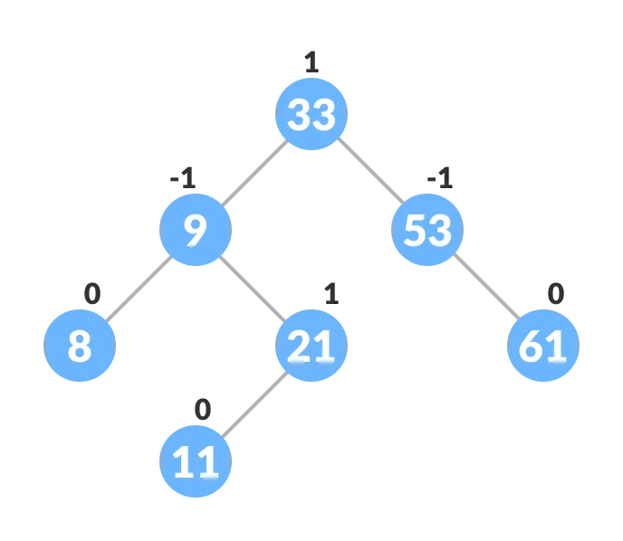

# Trees

## AVL Tree

An AVL is a **self-balancing Binary Search Tree** (BST) where the difference between the heights of left and right subtrees of any node cannot be more than one; this is called **balance factor**. Each node in an AVL tree has a balance factor.

**Balance Factor** = (Height of Left Subtree - Height of Right Subtree) or (Height of Right Subtree - Height of Left Subtree)

The self balancing property of an avl tree is maintained by the balance factor. The value of balance factor should always be -1, 0 or +1.

### Rotating the subtrees in an AVL Tree

The tree's sway is maintained thanks to the balance factor and rotations. In a rotation operation, the positions of the nodes of a subtree are interchanged.

There are two types of rotations:

- **Left Rotate**: In left-rotation, the arrangement of the nodes on the right is transformed into the arrangements on the left node.
- **Right Rotate**: In right-rotation, the arrangement of the nodes on the left is transformed into the arrangements on the right node.

### Inserting and Deleting a Node

The insertion operation is performed as in a Binary Search Tree, we just have to update the balance factor.

A node is always deleted as a leaf node. After deleting a node, the balance factors of the nodes get changed. In order to rebalance the balance factor, **suitable rotations are performed**. There are three cases for deleting a node:

- If the node is the **leaf node**, just delete it and update the balance factor.
- If the **node has one child**, then substitute the contents of the parent with the child. Remove the child and update the balance factor.
- If the **node has two children**, find the inorder successor of the node (ie. node with a minimum value of key in the right subtree), substitute the contents, remove the node and update the balance factor.

## Red-Black Tree

Red-Black tree is a **self-balancing binary search tree** in which **each node contains an extra bit for denoting the color** of the node, either red or black.

A red-black tree satisfies the following properties:

- **Red/Black Property**: Every node is colored, either red or black.
- **Root Property**: The root is black.
- **Leaf Property**: Every leaf (NIL) is black.
- **Red Property**: If a red node has children then, the children are always black.
- **Depth Property**: For each node, any simple path from this node to any of its descendant leaf has the same black-depth (the number of black nodes).

**Rotation operation is used for maintaining the properties** of a red-black tree when they are violated by other operations such as insertion and deletion. While inserting a new node, **the new node is always inserted as a RED node**. After insertion of a new node, if the tree is violating the properties of the red-black tree then, we do the following operations:

- Recolor
- Rotation

